# 🎨 **SISTEMA DE FLUXOGRAMA ARQUITETURAL IMPLEMENTADO**

## 🚀 **Melhorias Realizadas**

### ✅ **Problema Identificado:**
- Fluxograma anterior não era visualmente claro
- Não "cabia" adequadamente no espaço da página
- Não mostrava adequadamente fluxos arquiteturais
- Não era colorido nem bem estruturado

### 🎯 **Solução Implementada:**

#### 1. **Novo Componente: MermaidArchitectureFlowchart**
- **Arquivo**: `src/components/MermaidArchitectureFlowchart.tsx`
- **Função**: Gerar fluxogramas arquiteturais específicos por categoria
- **Tecnologia**: Mermaid.js para diagramas profissionais

#### 2. **Componente de Renderização: MermaidRenderer**
- **Arquivo**: `src/components/MermaidRenderer.tsx`
- **Função**: Renderizar diagramas Mermaid diretamente no navegador
- **Biblioteca**: `mermaid` npm package

#### 3. **Fluxogramas Especializados por Categoria:**

##### 🔄 **Workflows (Fluxo Principal)**

```mermaid
flowchart TD
    Start([🚀 Início do Workflow]) --> Trigger{Evento Trigger}
    Trigger -->|push| Push[📤 Push Event]
    Trigger -->|pull_request| PR[🔄 Pull Request Event]
    Trigger -->|schedule| Schedule[⏰ Scheduled Event]
    Trigger -->|workflow_dispatch| Manual[👤 Manual Trigger]
    
    Push --> Runner[🏃 GitHub Runner]
    PR --> Runner
    Schedule --> Runner
    Manual --> Runner
    
    Runner --> Job1[📋 Job 1: Build]
    Runner --> Job2[📋 Job 2: Test]
    Runner --> Job3[📋 Job 3: Deploy]
```

##### 🎭 **Actions (Marketplace & Custom)**

```mermaid
flowchart TD
    Dev[👨‍💻 Developer] --> Code[📝 Write Code]
    Code --> Push[📤 Git Push]
    Push --> Webhook[🔗 GitHub Webhook]
    
    Webhook --> Trigger{Action Trigger}
    Trigger --> Runner[🏃 GitHub Runner]
    
    Runner --> Actions[🎭 GitHub Actions]
    Actions --> Marketplace[🛒 Actions Marketplace]
    
    Marketplace --> Checkout[📋 actions/checkout@v3]
    Marketplace --> Setup[🔧 actions/setup-node@v3]
    Marketplace --> Custom[⚙️ Custom Action]
```

##### 🏃 **Runners (GitHub-hosted vs Self-hosted)**

```mermaid
flowchart TD
    Workflow[🔄 Workflow Triggered] --> RunnerSelect{Selecionar Runner}
    
    RunnerSelect -->|GitHub-hosted| GHRunner[☁️ GitHub-hosted Runner]
    RunnerSelect -->|Self-hosted| SHRunner[🏢 Self-hosted Runner]
    RunnerSelect -->|Larger| LargerRunner[💪 Larger Runner]
    
    GHRunner --> Ubuntu[🐧 Ubuntu Latest]
    GHRunner --> Windows[🪟 Windows Latest]
    GHRunner --> MacOS[🍎 macOS Latest]
    
    SHRunner --> OnPrem[🏢 On-Premises]
    SHRunner --> Cloud[☁️ Cloud Instance]
    SHRunner --> Container[🐳 Container]
```

##### 🔒 **Security (Secrets & Permissions)**

```mermaid
flowchart TD
    Code[📝 Code Changes] --> Security{🔒 Security Check}
    
    Security --> Secrets[🔐 Secrets Management]
    Security --> Permissions[👥 Permissions]
    Security --> Audit[📊 Audit Logs]
    
    Secrets --> Vault[🏦 GitHub Secrets]
    Secrets --> Env[🌐 Environment Variables]
    Secrets --> OIDC[🆔 OIDC Tokens]
    
    Permissions --> Read[👀 Read Access]
    Permissions --> Write[✍️ Write Access]
    Permissions --> Admin[👑 Admin Access]
```

##### ☁️ **Azure (GitHub Actions + Azure)**

```mermaid
flowchart TD
    GitHub[📱 GitHub Repository] --> Action[🎭 GitHub Action]
    Action --> Azure[☁️ Azure Login]
    
    Azure --> Auth{Authentication}
    Auth -->|Service Principal| SP[🔑 Service Principal]
    Auth -->|Managed Identity| MI[🆔 Managed Identity]
    Auth -->|OIDC| OIDC[🔐 OIDC Token]
    
    SP --> AzureCLI[⚡ Azure CLI]
    MI --> AzureCLI
    OIDC --> AzureCLI
    
    AzureCLI --> Resources{Azure Resources}
    Resources --> WebApp[🌐 Web App]
    Resources --> Functions[⚡ Functions]
    Resources --> Storage[💾 Storage]
    Resources --> Database[🗄️ Database]
```

## 🎨 **Características Visuais**

### 🌈 **Sistema de Cores por Categoria**
- **Workflows**: Azul (#2563eb, #3b82f6)
- **Actions**: Roxo (#7c3aed, #8b5cf6)
- **Runners**: Ciano (#0891b2, #06b6d4)
- **Security**: Vermelho (#dc2626, #ef4444)
- **GitHub Actions**: Cinza (#1f2937, #374151)
- **Azure**: Azul Microsoft (#0078d4, #106ebe)

### 🎭 **Elementos Visuais**
- **Emojis**: Contextuais para cada tipo de elemento
- **Formas**: Círculos para início/fim, losangos para decisões, retângulos para processos
- **Conectores**: Setas direcionais coloridas
- **Destaque**: Respostas corretas/incorretas em cores específicas

### 📱 **Responsividade**
- **Container**: Responsivo com overflow-x-auto
- **Tamanho**: Mínimo 400px de altura
- **Visualização**: Adapta-se ao tamanho da tela
- **Fallback**: Código Mermaid raw para visualização externa

## 🔧 **Funcionalidades Implementadas**

### 1. **Renderização Dinâmica**
- Geração automática baseada na categoria da questão
- Cores específicas para cada tipo de fluxo
- Destaque das respostas do usuário

### 2. **Interatividade**
- Botão para expandir/colapsar
- Copiar código Mermaid para clipboard
- Visualização em mermaid.live (externa)

### 3. **Análise de Resposta**
- Destaque visual da resposta do usuário
- Comparação com resposta correta
- Explicação contextual

### 4. **Integração Completa**
- Funciona com sistema de múltipla seleção
- Integrado ao QuestionCard
- Compatível com persistência de dados

## 🚀 **Como Usar**

### 1. **Automático**
- Responda uma questão
- Clique em "Confirmar Resposta"
- Clique em "Ver Fluxograma Arquitetural"
- Fluxograma aparece colorido e animado

### 2. **Personalização**
- Cada categoria tem seu próprio fluxograma
- Cores e elementos específicos para o contexto
- Explicação visual do conceito

### 3. **Exportação**
- Copiar código Mermaid
- Visualizar em mermaid.live
- Integrar em documentação

## 📊 **Resultados Obtidos**

### ✅ **Problemas Resolvidos:**
- ✅ Fluxograma agora é visualmente claro
- ✅ Cabe perfeitamente no espaço disponível
- ✅ Mostra fluxos arquiteturais reais
- ✅ Colorido e profissional
- ✅ Específico para cada categoria

### 🎯 **Benefícios:**
- 🎨 **Visual**: Diagramas profissionais e coloridos
- 🏗️ **Arquitetural**: Mostra fluxos técnicos reais
- 📱 **Responsivo**: Adapta-se a qualquer tela
- 🔄 **Dinâmico**: Muda conforme a categoria
- 🎯 **Educativo**: Facilita o aprendizado visual

## 🔧 **Tecnologias Utilizadas**

- **Mermaid.js**: Geração de diagramas profissionais
- **React**: Componentização e interatividade
- **TypeScript**: Tipagem e robustez
- **Tailwind CSS**: Estilização responsiva
- **Dynamic Import**: Carregamento otimizado do Mermaid

## 📝 **Arquivos Criados/Modificados**

### 🆕 **Novos Arquivos:**
- `src/components/MermaidArchitectureFlowchart.tsx`
- `src/components/MermaidRenderer.tsx`

### 🔄 **Arquivos Modificados:**
- `src/components/QuestionCard.tsx` (integração)
- `src/components/FlowchartDemo.tsx` (demo)
- `package.json` (dependência mermaid)

### 📦 **Dependências:**
- `mermaid`: ^10.6.1

---

**Status**: ✅ **Implementado e Funcionando**
**Teste**: ✅ **Build Successful**
**Servidor**: ✅ **Funcionando em http://localhost:3000**

### 🎯 **Próximos Passos Opcionais:**
1. Adicionar mais tipos de fluxograma (Gantt, Sequence, etc.)
2. Permitir edição inline do código Mermaid
3. Exportar fluxogramas como PNG/SVG
4. Integrar com sistema de favoritos
5. Adicionar tooltips explicativos nos elementos
