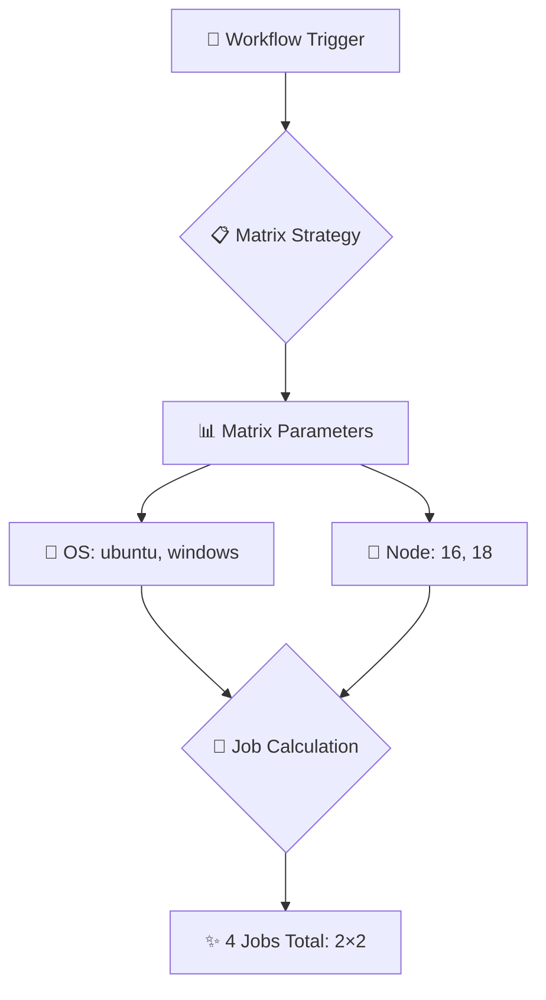
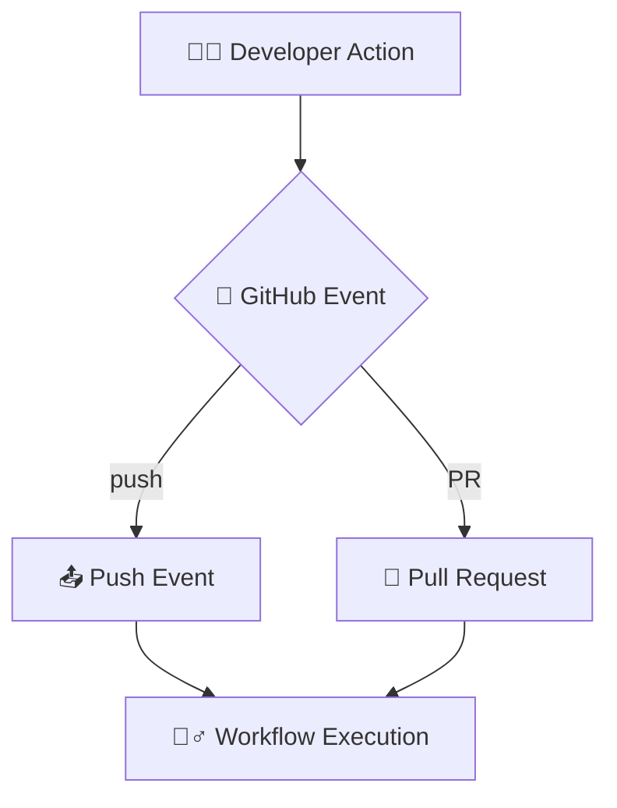
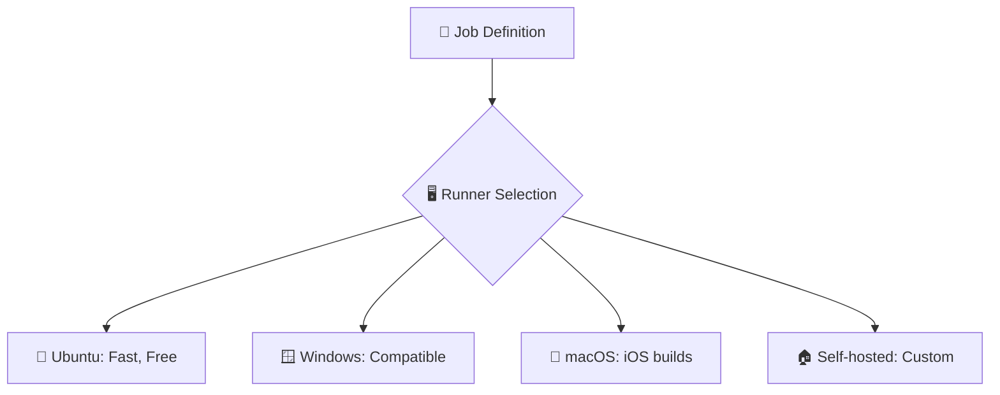

# 🚀 Sistema de Fluxogramas Inteligentes - GitHub Actions GH-200 Simulator

## 📋 Visão Geral

Implementamos um sistema avançado de geração de fluxogramas Mermaid contextuais que utiliza IA (Azure OpenAI/OpenAI) para criar diagramas específicos para cada cenário de questão, com sistema de cache inteligente para otimizar performance.

## 🎯 Objetivos Alcançados

### ✅ 1. Geração Contextual de Fluxogramas
- **IA-Powered**: Utiliza Azure OpenAI ou OpenAI para gerar fluxogramas específicos
- **Detecção Automática**: Identifica automaticamente o tipo de cenário da questão
- **Templates Locais**: Sistema de fallback com templates locais caso a IA não esteja disponível
- **Explicação Visual**: Fluxogramas que mostram POR QUE a resposta está correta

### ✅ 2. Sistema de Cache Inteligente
- **Cache Persistente**: Armazenamento local dos fluxogramas gerados
- **Expiração Automática**: Limpeza automática de itens antigos (7 dias)
- **Importação/Exportação**: Backup e compartilhamento de cache
- **Monitoramento**: Interface visual para gerenciar o cache

### ✅ 3. Detecção de Cenários
- **Matrix Strategy**: Questões sobre estratégias de matriz de jobs
- **Workflow Triggers**: Eventos e gatilhos de workflows
- **Runner Selection**: Seleção e configuração de runners
- **Secrets Management**: Gestão de secrets e variáveis
- **Permissions**: Controle de acesso e permissões
- **Action Usage**: Uso de actions e marketplace
- **Deployment**: Estratégias de deploy e ambientes
- **Conditional Execution**: Execução condicional
- **Artifacts**: Gestão de artefatos
- **Caching**: Cache de dependências

## 🛠️ Arquitetura Implementada

### Componentes Principais

#### 1. **AIFlowchartGenerator** (`src/lib/aiFlowchartGenerator.ts`)
```typescript
// Funcionalidades principais
- generateFlowchart(): Gera fluxograma contextual
- detectScenario(): Identifica tipo de cenário  
- buildPrompt(): Constrói prompt específico para IA
- callAIService(): Chama Azure OpenAI/OpenAI
- generateLocalFlowchart(): Fallback com templates locais
```

#### 2. **FlowchartCacheManager** (`src/lib/flowchartCache.ts`)
```typescript
// Funcionalidades de cache
- get(): Recupera fluxograma do cache
- set(): Armazena novo fluxograma
- clear(): Limpa cache completo
- exportCache(): Exporta dados do cache
- importCache(): Importa dados de cache
- getCacheStats(): Estatísticas do cache
```

#### 3. **MermaidArchitectureFlowchartNew** (`src/components/MermaidArchitectureFlowchartNew.tsx`)
```typescript
// Interface principal
- Integração com IA e cache
- Interface de loading e erro
- Botões de regeneração e controle
- Indicadores de fonte (Azure/OpenAI/Cache/Local)
```

#### 4. **FlowchartCacheMonitor** (`src/components/FlowchartCacheMonitor.tsx`)
```typescript
// Monitor do cache
- Visualização de estatísticas
- Controles de import/export
- Limpeza de cache
- Atualização em tempo real
```

#### 5. **API Route** (`src/app/api/generate-flowchart/route.ts`)
```typescript
// Endpoint para IA
- Integração com Azure OpenAI
- Fallback para OpenAI direto  
- Limpeza e validação de código Mermaid
- Tratamento de erros
```

## 🔧 Configuração

### Variáveis de Ambiente
```bash
# Azure OpenAI Configuration
AZURE_OPENAI_ENDPOINT=https://your-resource-name.openai.azure.com/
AZURE_OPENAI_API_KEY=your-api-key-here
AZURE_OPENAI_DEPLOYMENT_NAME=gpt-4

# OpenAI Configuration (fallback)
OPENAI_API_KEY=your-openai-api-key-here
```

### Fluxo de Funcionamento
1. **Questão Processada** → Análise do conteúdo para detectar cenário
2. **Verificação de Cache** → Busca por fluxograma já gerado
3. **Geração com IA** → Chama Azure OpenAI se cache vazio
4. **Fallback Local** → Usa templates se IA falhar
5. **Cache e Exibição** → Salva resultado e exibe para usuário

## 📊 Tipos de Cenários Suportados

### 1. **Matrix Strategy**


### 2. **Workflow Triggers**


### 3. **Runner Selection**


## 💡 Exemplo de Prompt para IA

```
Você é um especialista em GitHub Actions criando diagramas educacionais.

CONTEXTO DA QUESTÃO:
Questão: "How many jobs will result from the following matrix configuration?"
Cenário detectado: matrix-strategy

CÓDIGO DE EXEMPLO:
strategy:
  matrix:
    os: [ubuntu-latest, windows-latest]
    node-version: [16, 18]

RESPOSTA CORRETA: B (4 jobs)

TAREFA:
Crie um fluxograma que demonstre ESPECIFICAMENTE como a matriz combina
os parâmetros e por que resulta em 4 jobs (2 OS × 2 versões = 4).

Use cores: verde para correto, vermelho para processo, azul para decisão.
```

## 🎨 Interface Visual

### Indicadores de Fonte
- **🌟 Azure AI**: Fluxograma gerado com Azure OpenAI
- **🤖 OpenAI**: Fluxograma gerado com OpenAI direto  
- **⚡ Cache**: Fluxograma recuperado do cache
- **🏠 Local**: Template local (fallback)

### Monitor de Cache
- **📊 Estatísticas**: Total de entradas, tamanho, datas
- **🔄 Controles**: Atualizar, exportar, importar, limpar
- **📈 Visualização**: Progresso e uso do cache

## 🚀 Como Usar

### 1. **Para Usuários Finais**
- Responda qualquer questão normalmente
- Clique em "Ver Fluxograma Arquitetural" 
- O sistema detecta automaticamente o cenário
- Fluxograma contextual é gerado e explicado

### 2. **Para Desenvolvedores**
```typescript
// Usar o gerador diretamente
const generator = AIFlowchartGenerator.getInstance();
const result = await generator.generateFlowchart({
  question,
  userAnswers,
  correctAnswers,
  isCorrect
});
```

### 3. **Para Administradores**
- Configure as APIs Azure/OpenAI
- Monitore uso através do FlowchartCacheMonitor
- Exporte/importe cache conforme necessário

## 📈 Benefícios Implementados

### Para Estudantes
- **Compreensão Visual**: Fluxogramas específicos para cada cenário
- **Explicação Contextual**: Entenda POR QUE a resposta está correta
- **Aprendizado Ativo**: Visualize o funcionamento real do GitHub Actions
- **Feedback Inteligente**: Diagramas adaptativos baseados na resposta

### Para Educadores  
- **Conteúdo Dinâmico**: Fluxogramas gerados automaticamente
- **Qualidade Consistente**: IA garante explicações precisas
- **Cache Eficiente**: Performance otimizada
- **Flexibilidade**: Suporta qualquer tipo de questão

### Para o Sistema
- **Performance**: Cache reduz tempo de resposta
- **Escalabilidade**: Múltiplos provedores de IA
- **Confiabilidade**: Fallbacks garantem funcionamento
- **Manutenibilidade**: Arquitetura modular e extensível

## 🔄 Fluxo Completo de Uma Questão

1. **Usuário responde questão** sobre matriz de jobs
2. **Sistema detecta** cenário "matrix-strategy" 
3. **Cache é verificado** para esta questão específica
4. **Se não encontrado**, gera prompt contextual
5. **Azure OpenAI** cria fluxograma mostrando 2×2=4 jobs
6. **Resultado é salvo** no cache para próximas vezes
7. **Fluxograma é exibido** com explicação visual
8. **Usuário compreende** por que são 4 jobs, não 2

## 🎯 Próximos Passos (Opcionais)

- [ ] Suporte a fluxogramas interativos
- [ ] Integração com mais provedores de IA
- [ ] Analytics de uso dos fluxogramas
- [ ] Personalização de estilos por usuário
- [ ] Versionamento de fluxogramas
- [ ] Colaboração e compartilhamento

## 🏆 Conclusão

Este sistema revoluciona a experiência educacional do simulador, transformando explicações textuais em experiências visuais inteligentes e contextuais. A combinação de IA, cache inteligente e fallbacks locais garante uma experiência robusta e educativa para todos os tipos de questões do GitHub Actions.

O resultado é um sistema que não apenas mostra fluxogramas, mas **explica visualmente por que cada resposta está correta**, tornando o aprendizado mais efetivo e engajante.
